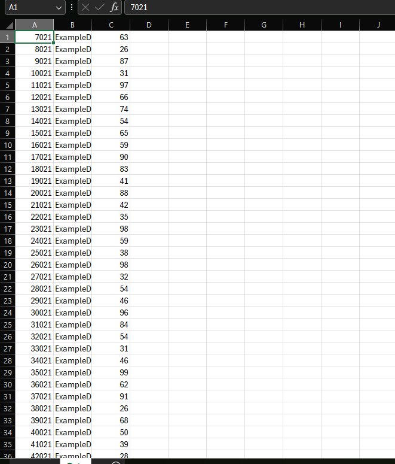
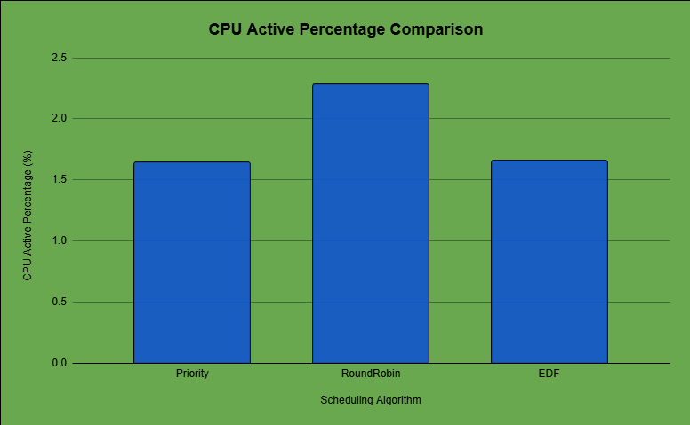
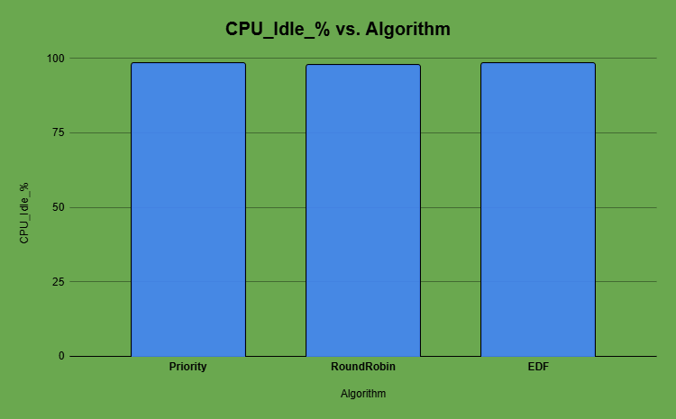

# Experimental Analysis of RTOS Scheduling Policies on ESP32


This project presents an experimental evaluation of different RTOS scheduling
algorithms on an ESP32-based embedded system, focusing on CPU utilization and
energy efficiency.

The study compares Priority Scheduling, Round Robin Scheduling, and Earliest
Deadline First (EDF) under identical task workloads using FreeRTOS.

---

## Project Motivation

In embedded and IoT systems, task scheduling directly impacts system
responsiveness, CPU utilization, and power consumption.

Rather than relying on theoretical analysis alone, this project uses real
execution data collected from an ESP32 microcontroller to experimentally
evaluate scheduling behavior.

---

## Scheduling Algorithms Evaluated

The following RTOS scheduling algorithms are implemented and tested:

- Priority-Based Scheduling
- Round Robin Scheduling
- Earliest Deadline First (EDF)

Each algorithm is evaluated independently using the same task set to ensure
fair comparison.

---

## System Overview

The system consists of periodic tasks running under FreeRTOS on ESP32.
Task execution data is logged in structured CSV format via serial
communication and analyzed offline.

---

## Project Architecture

Application Tasks (GasTask, TempTask)
|
v
FreeRTOS Scheduler
(Priority / RR / EDF)
|
v
ESP32 CPU
|
v
Serial CSV Logger
|
v
Offline Analysis
(CPU Utilization & Energy)


Detailed architecture is documented in:
docs/architecture.md


---

## Hardware and Software Setup

### Hardware
- ESP32 Dev Module
- USB Power Supply

### Software
- FreeRTOS (ESP32)
- Arduino IDE (firmware upload)
- Visual Studio Code (serial logging)
- Google Sheets / Excel (analysis)

---

## Task Design

Two periodic tasks are used to simulate sensor workloads:

### GasTask
- Priority: High
- Period: 1000 ms
- Execution Time: ~15 ms
- Represents time-critical sensing

### TempTask
- Priority: Low
- Period: 5000 ms
- Execution Time: ~8 ms
- Represents background sensing

---

## Data Collection Methodology

- Task execution data is printed in CSV format
- Logging is limited to 500 records per experiment
- VS Code Serial Monitor is used for automatic file logging
- Each scheduling algorithm is tested separately

Detailed methodology is available in:
docs/experiment_methodology.md


---

## Sample Serial Logging Output

The following image shows structured CSV logging captured via VS Code:


---

## CSV Dataset Example

After logging, data is converted into CSV format and imported into a
spreadsheet for analysis:



---

## CPU Utilization Analysis

CPU utilization is computed using the formula:

CPU Active (%) = (Total Execution Time / Total Runtime) × 100
CPU Idle (%) = 100 − CPU Active (%)


The following graph illustrates CPU utilization differences across scheduling
algorithms:




---

## Results Summary

| Algorithm       | CPU Active | CPU Idle | Key Observation                  |
|-----------------|------------|----------|----------------------------------|
| Priority        | Low        | High     | Deterministic, preemptive        |
| Round Robin     | Medium     | Medium   | Fair, higher context switching  |
| EDF             | Low        | High     | Deadline-aware, energy-efficient|

---

## Energy Efficiency Discussion

Higher CPU idle time indicates lower power consumption.
Based on experimental results:

- EDF demonstrates the best energy efficiency
- Priority scheduling performs well for critical tasks
- Round Robin trades efficiency for fairness

---

## Repository Structure

```text
rtos-scheduling-experiment-esp32/
│
├── src/
│ ├── priority_scheduling.ino
│ ├── round_robin_scheduling.ino
│ └── edf_scheduling.ino
│
├── data/
│ ├── priority_logs.csv
│ ├── round_robin_logs.csv
│ └── edf_logs.csv
│
├── analysis/
│ ├── cpu_utilization.xlsx
│ └── energy_comparison.xlsx
│
├── docs/
│ ├── architecture.md
│ ├── experiment_methodology.md
│ └── results_analysis.md
│
├── screenshots/
│
├── README.md
└── LICENSE

```

---

## Key Learnings

- Scheduling policy significantly affects CPU utilization
- Data collection design is critical for experimental validity
- EDF is well-suited for periodic real-time workloads
- Experimental evaluation complements theoretical analysis

---

## Limitations

- Power consumption is estimated indirectly
- Sensor behavior is simulated
- Interrupt-driven and network tasks are excluded

---

## Future Work

- Integrate real sensors
- Measure actual power consumption
- Explore multicore scheduling
- Extend task complexity
- Publish results as a conference paper

---

## Author

Shahriar Alom Masud  
B.Sc. Engg. in IoT & Robotics Engineering  
University of Frontier Technology, Bangladesh  
Email: shahriar0002@std.uftb.ac.bd  
LinkedIn: https://www.linkedin.com/in/shahriar-alom-masud

---
## License

This project is licensed for educational and research purposes.

---
